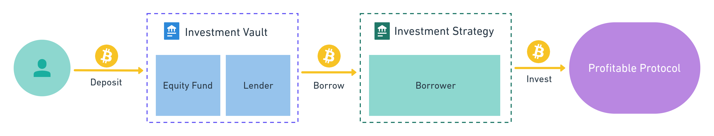

We are glad to announce that we finished big research on major yield farm protocols! 

Based on found ideas and conceptions, we made two prototypes of the smart contract protocol! 

We tested a few approaches to the realization of vaults, to observe the pros and cons of popular implementations of farms.

## 🧪 Research

1. Two concepts underpin all smart contracts: equity fund and lender (more of that [in our prototype description](https://github.com/LeoVS09/simple-yield-farm#contracts)). Usually, both conceptions are mixed. That's why the **majority of protocols are complex and error-prone** 🤔
2. All farms move temporal losses and fees of invested smart contracts to the user 😤 **This hurts newcomers:**
— They withdraw money too soon, as they don't trust the new tool yet. And commissions eat up all the profit.
— They are not patient enough to wait out temporal losses.
3. All farms should calculate the exchange rates of tokens and shares of the vault. The rate depends on oracles or smart contracts. If someone finds a way to manipulate invested smart contract or oracle rates, he will be able to **clear out the whole vault** 😱 There are exceptions, e.g. [Yearn Finance](https://yearn.finance/) solved the problem of possible hacks and manipulations of the vault exchange rates.
4. Some protocols don’t use rounding calculation to prevent **losses of the tokens** during calculations. Long living vaults make big amount calculations, and each of them can lose a small fraction of the tokens
5. Most farming protocols will **lose user money** in case of assets are locked in the invested protocol. But for example, [Yearn Finance](https://yearn.finance/) takes care of such tokens and keeps user shares in case the money becomes available for withdrawal.

## 🚀 Prototypes

* [Simple-Yield-Garm repository](https://github.com/LeoVS09/simple-yield-farm)
* [Eonian-Vault repository](https://github.com/solovev/eonian-vault)

We developed prototypes with **extensibility in mind**. Architecture is mostly influenced by [Harvest Finance](https://harvest.finance/), [Yearn Finance](https://yearn.finance/), [Pickle Finance](https://www.pickle.finance/). But we made many improvements and simplified the main vault smart contract. The prototypes show how to split business logic parts, test them separately and update them without unexpected bugs.

Several prototypes show us that the calculations of temporal losses can be done in different ways and how to approach the reinvestment cycle inside the vault contract. Some variants lead to the simpler calculation but do not track losses at all, others track them but do not try to minimize losses that go on the user side.

### 🏯 Equity Fund/Lender Architecture

The [prototype](https://github.com/LeoVS09/simple-yield-farm) consists of multiple small smart contracts. Together they result in two big smart contracts. The first is **Investment Vault**, which store tokens, distributes profits, and allow Strategy to borrow these tokens for investments. The second contract is **Investment Strategy**, which borrows tokens from the Vault and invests them into a profitable contract, in our case, it invests money into [dForce](https://dforce.network/) Lending protocol.

Investment Vault consists of two parts itself. The first part is the **Equity Fund** contract, which allows users to communicate with the vault, it exchanges the shares and tokens. Through shares distributed profit and losses of the vault. The second part is the **Lending** contract, this contract communicates with strategy, he allows strategy to borrow the assets of the vault and can ask strategy to return assets into the vault.

---

## 🧭 Future Plans

- We will make a dApp UI for the prototypes. It will allow us to find better implementations of future fully working applications.